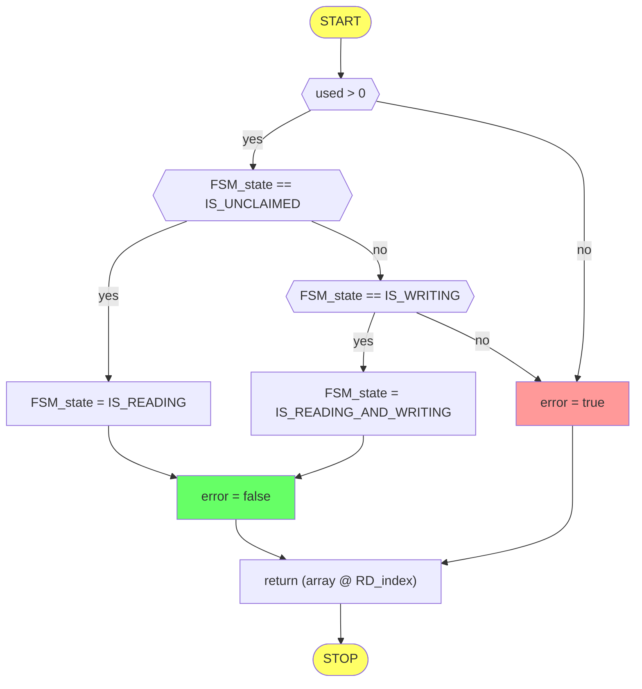
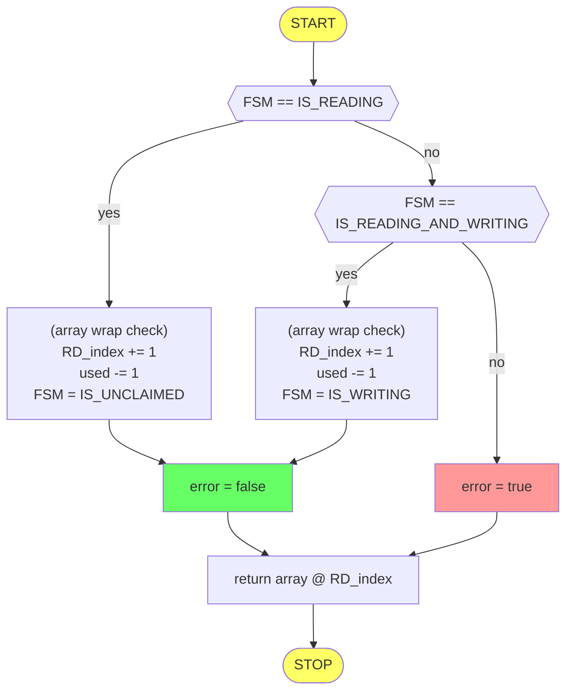
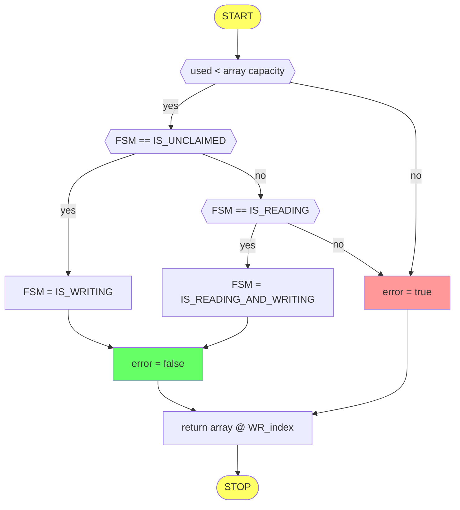
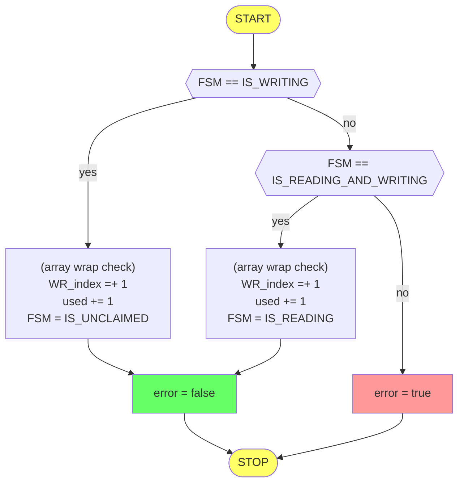
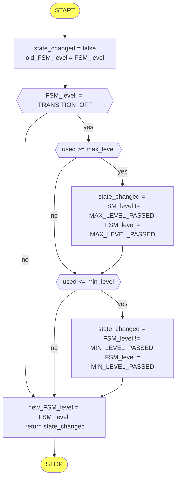

## **GArrayRoller**
All **GArrayRoller** functions use the **std::lock_guard** to arbitrate the **std::mutex** ownership.

&nbsp;

List of possible **FSM_state** values:
1. IS_UNCLAIMED
2. IS_READING
3. IS_WRITING
4. IS_READING_AND_WRITING

&nbsp;

List of possible **FSM_level** values:
1. TRANSITION_OFF
2. REGULAR_LEVEL
3. MAX_LEVEL_PASSED
4. MIN_LEVEL_PASSED

&nbsp;
## **GArrayRoller::Reading_Start()**

&nbsp;
## **GArrayRoller::Reading_Stop()**

&nbsp;
## **GArrayRoller::Writing_Start()**

&nbsp;
## **GArrayRoller::Writing_Stop()**

&nbsp;
## **GArrayRoller::IsLevelChanged()**

