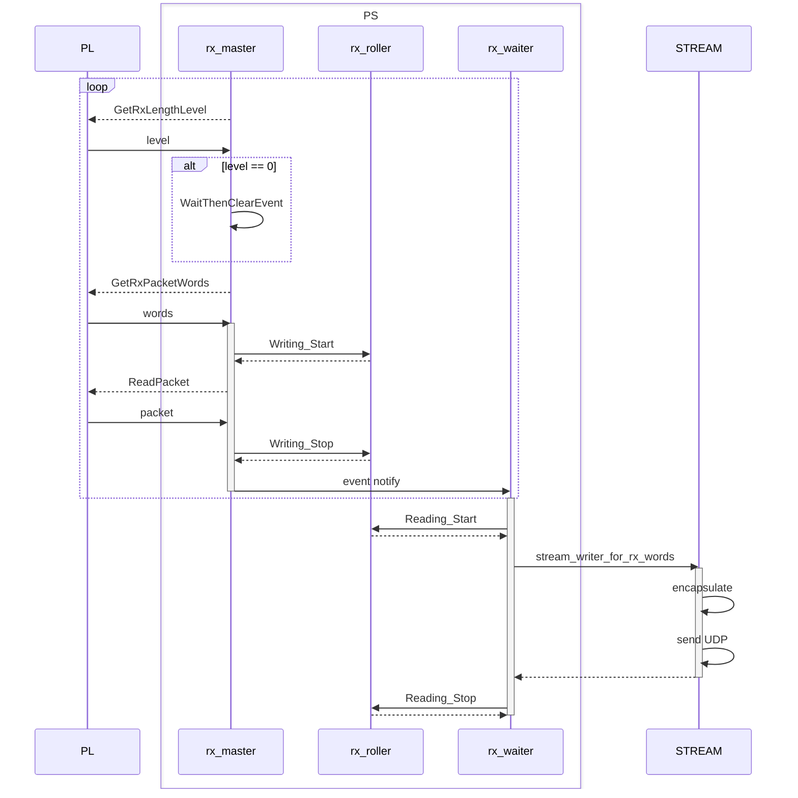

## **FIFO rx_master rx_waiter**

```mermaid
sequenceDiagram

participant PL
box PS
participant RM as rx_master
participant RL as rx_roller
participant RW as rx_waiter
end
participant SW as STREAM

loop 
    RM -->>PL: GetRxLengthLevel
    PL ->> RM: level

    alt level == 0
        RM ->> RM: WaitThenClearEvent
    end

    RM -->>PL: GetRxPacketWords
    PL ->> RM: words
 
    activate RM
    RM ->> RL: Writing_Start
    RL -->>RM: 
    RM -->>PL: ReadPacket
    PL ->> RM: packet
    RM ->> RL: Writing_Stop
    RL -->>RM: 
    RM ->> RW: event notify
    deactivate RM
end
    activate RW
    RW ->> RL: Reading_Start
    RL -->>RW: 
    RW ->> SW: stream_writer_for_rx_words
    activate SW
    SW ->> SW: encapsulate
    SW ->> SW: send UDP
    SW -->>RW: 
    deactivate SW
    RW ->> RL: Reading_Stop
    RL -->>RW: 
    deactivate RW

```