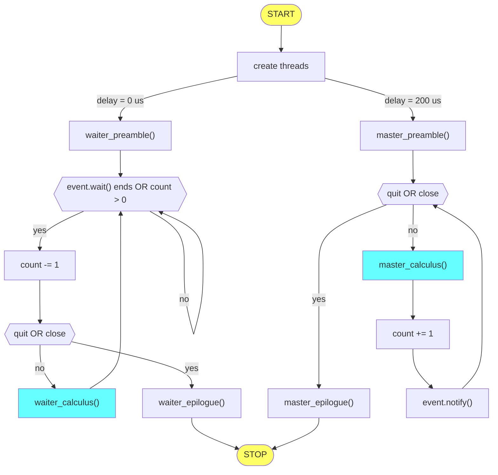

## **GWorksCoupler**

Threads use the **std::unique_lock** to arbitrate the **std::mutex** ownership.

```mermaid
flowchart TB

style start fill:#FF6
style stop  fill:#FF6
style WC    fill:#6FF
style MC    fill:#6FF

start([START]) -->

A0[create threads]
A0 -- delay =   0 us --> W1
A0 -- delay = 200 us --> M1

W1["waiter_preamble()"] --> W2

W2{{"event.wait() ends OR count > 0"}}
W2 -- no  --> W2
W2 -- yes --> W3

W3[count -= 1] --> W4

W4{{"quit OR close"}}
W4 -- no  --> WC
W4 -- yes --> WE

WC["waiter_calculus()"] --> W2
WE["waiter_epilogue()"] --> stop

M1["master_preamble()"] --> M2

M2{{"quit OR close"}}
M2 -- no  --> MC
M2 -- yes --> ME

MC["master_calculus()"] -->
M4[count += 1] -->
M5["event.notify()"] --> M2

ME["master_epilogue()"] --> stop

stop([STOP])
```
